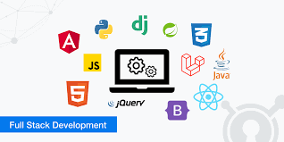

.

## How To Become a **Full Stack** Web Developer?

##GROWTH MINDSET

**Markdown** is a lightweight markup language that describes how text should look on a page.

*italic*
**bold**
***bold italic***

# section heading

[CLICK TO VISIT THE MARKDOWN SHEET]([https://nestacms.com/docs/creating-content/markdown-cheat-sheet](https://www.freecodecamp.org/news/markdown-cheatsheet/)https://www.freecodecamp.org/news/markdown-cheatsheet/)
